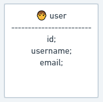

# CRUD (Create, Read, Update and Delete)
CRUD feito em Node, com TypeORM, MySQL e TypeScript. A parte mobile está sendo feita com react native.

# Sobre o projeto

O projeto é um CRUD simples com apenas uma tabela, o projeto é feito em NodeJS, TypeORM e MySQL. 
A parte mobile é feita em React Native e tem como único objetivo consumir a API.

#

